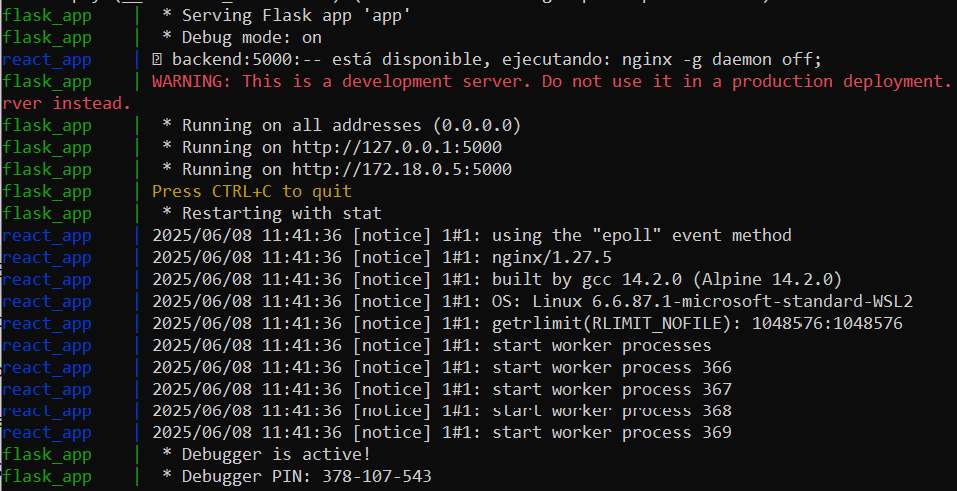
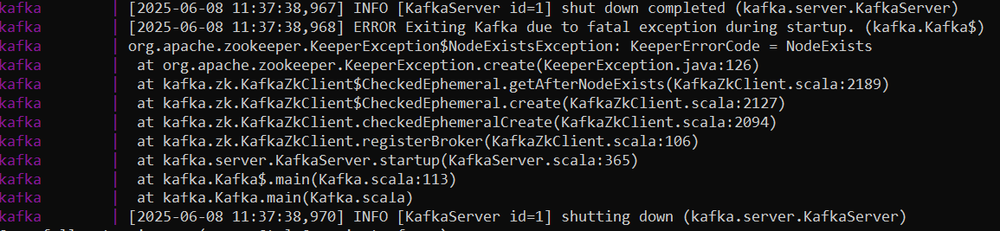

### Instrucciones sobre ejecución
- Abrir **Docker** y dirigirte a la raíz del proyecto.
- Ejecutar el comando **docker-compose build** que se encargará de crear las imágenes y contenedores pertinentes.
- Al crearse los contenedores ejecutar el comando **docker-compose up** para levantar los contenedores.
- Esperar a que se despliegue totalmente (esperar 3-5 min). Aplicación totalmente desplegada: 
- Puede que Kafka de errores ya que depende de Zookeeper y hay veces que se ejecuta antes Kafka aunque depende del otro contenedor, si ocurre lo que muestra la siguiente imagen hacer **CTRL + C** y volver a ejecutar **docker-compose up**:
 
- Si se despliega correctamente ir a navegador y ejecutar localhost:3000.
